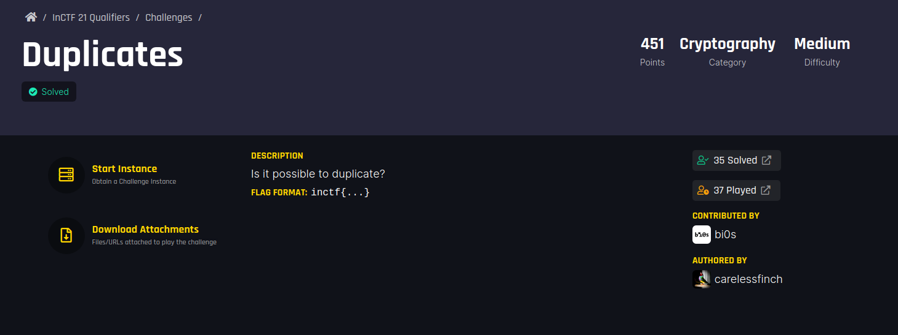

## Challenge Name : Duplicates

<p align="center"></p>

#### Challenge file:

```
from Crypto.Util.number import getPrime
from secret import flag
pt=int(flag.hex(),16)

def gen():
    p,q=getPrime(512),getPrime(512)
    e,n=65537,p*q
    ct=pow(pt,e,n)
    d=pow(e,-1,(p-1)*(q-1))
    return ct,d,n,[p,q]

if __name__ == '__main__':
    ct,d1,n,pq=gen()
    print(pq)
    d2=int(input("> "))
    if d2!=d1:
        if pow(ct,d2,n)==pt:
            print(f"Good Job!!\n{flag.decode()}")
        else:
            print("bruh")
    else:
        print("Are you for real??")
```

- The challange runs on the remote instance where we have to give the value of d  to decrypt the flag
- We were given with values of p and q when running the instance.

```
pq = [9271027477113701235755350545719977174599676462901577644714811380208294215204090221612185375557990680124488952535641704656501628556848766875472425673189497, 9138046549037796433974516840615141901475690892121490151554506619221318177641251570519278540381108700024825885518437955535114986879514659998608890291099949]
```
- RSA simple caculations

```
p = pq[0]
q = pq[1]
phi = (p-1) * (q-1)
e=65537 #given
    
d = inverse(e,phi)

With d we can decrypt the plaintext.
```
- But the twist here is gen() already generated d with the same formula  d1=pow(e,-1,(p-1)*(q-1))
- The user given input is taken as d2 and if d1 == d2,we will be exit from the instance saying "Are you for real??"
- If we give some other values for d ,we will get exit from the instance saying "bruh".
- Our soultion lies on finding d2 which does not match with d1 but still able to decrypt the plaintext when passing in the equation pow(ct,d2,n).
- Upon googling able to find the below converstation on multiple rsa private keys(d).

   https://crypto.stackexchange.com/questions/39486/is-it-possible-to-have-multiple-rsa-private-keys

   

- Upon understanding we get to know the formula e^-1 mod(lcm(p-1)*(q-1))
- This is to find the minimal decrypting exponent and we can call this as d2
- Hence we satisfied d2 != d1 and we can now decrpty the plaintext.

```
d2 = inverse(e,gmpy2.lcm(p-1,q-1))
```
- Sending d2 to the instance we get the flag 
 "Good Job!!
  inctf{Seems_l1k3_LCM_1s_n0t_Us3less} "
  
 #### Flag:
  inctf{Seems_l1k3_LCM_1s_n0t_Us3less}
