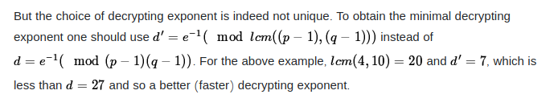

## Challenge Name : Duplicates

DESCRIPTION:
Is it possible to duplicate?

FLAG FORMAT:
inctf{...}

#### Challenge file:

```
from Crypto.Util.number import getPrime
from secret import flag
pt=int(flag.hex(),16)

def gen():
    p,q=getPrime(512),getPrime(512)
    e,n=65537,p*q
    ct=pow(pt,e,n)
    d=pow(e,-1,(p-1)*(q-1))
    return ct,d,n,[p,q]

if __name__ == '__main__':
    ct,d1,n,pq=gen()
    print(pq)
    d2=int(input("> "))
    if d2!=d1:
        if pow(ct,d2,n)==pt:
            print(f"Good Job!!\n{flag.decode()}")
        else:
            print("bruh")
    else:
        print("Are you for real??")
```

- The challange runs on the remote instance where we have to give the value of `d`  to decrypt the flag.
- We were given with values of `p` and `q` when running the instance.

```
pq = [9271027477113701235755350545719977174599676462901577644714811380208294215204090221612185375557990680124488952535641704656501628556848766875472425673189497, 9138046549037796433974516840615141901475690892121490151554506619221318177641251570519278540381108700024825885518437955535114986879514659998608890291099949]
```
#### RSA simple caculations

```
p = pq[0]
q = pq[1]
phi = (p-1) * (q-1)
e=65537 #given
    
d = inverse(e,phi)

With d we can decrypt the plaintext.
```
- But the twist here is gen() already generated d with the same formula  `d1=pow(e,-1,(p-1)*(q-1))`
- The user given input is taken as `d2` and if `d1 == d2`,we will be exit from the instance saying "Are you for real??"
- If we give some other values for `d` ,the program will try to decrypt the plaintext with the given `d` if not we will get exit from the instance saying "bruh".
- Our soultion lies on finding `d2` which does not match with d1 but still able to decrypt the plaintext when passing in the equation pow(ct,d2,n).
- Upon googling able to find the below converstation on multiple rsa private keys(d).

   https://crypto.stackexchange.com/questions/39486/is-it-possible-to-have-multiple-rsa-private-keys

   

- Upon understanding we get to know the formula `e^-1 mod(lcm(p-1)*(q-1))`.
- This is to find the minimal decrypting exponent and we can call this as `d2`.
- Hence we satisfied `d2 != d1` and we can now decrpty the plaintext.

```
d2 = inverse(e,gmpy2.lcm(p-1,q-1))
```
- Sending d2 to the instance we get the flag 
 "Good Job!!
  inctf{Seems_l1k3_LCM_1s_n0t_Us3less} "
  
  #### Flag:
   inctf{Seems_l1k3_LCM_1s_n0t_Us3less}
   
   `We can also use d+phi,d^2*e  for this challenge(got it from post challenge discuission)` 
 
 ---------------------------------------------------------------------------------------------------------------------------------------------------------------------------------------------------------------------------------------------------------------------------------------------------
 
## Challenge Name : common-extender

DESCRIPTION
Break the box to get the flag

FLAG FORMAT:
inctf{...} 

Challenge file:
```
from Crypto.Util.number import *
from secret import *
p=getPrime(1024)
q=getPrime(1024)
n=p*q
e=65537
e1=5**e 
e2=7**e
m=bytes_to_long(flag)
c1=pow(m,e1,n)
c2=pow(m,e2,n)
f=open('common.txt','wb')
f.write('c1 ='+str(c1)+'\n')
f.write('c2 ='+str(c2)+'\n')
f.write('n ='+str(n)+'\n')

output:

c1=4723005985613543187020628938921653359117769920118354915283034471439951923751100042324993738873335720499784832162124494724397874077445927539518170906182303071332375503334377466642151794243893906686488318314054581277279339354540824560289281377642476956195085157598596806724741328453851091266048989755240316042334268749726482498290550751421726074890664103854548877867102449424289393328824577607388404132540469861201309536143850843812921167352182401864201559799676471710328882434530114454019475040002543619441854896467180130953718013265450930254533163800232807408091288735463359738179843762952219190997088933076463800937

c2=10661271147018941693868519425015420669304227031149199140791386970019096952927137416689438586221525636852501069518071596639264468645491045897884647407076730835292758137798902431649278166782296895082822129633563506818700870154189144836361676276555629751239323641469875120324974236823100525239750663787201418512480903774505519091161838612044303655990682336151817250392594652014609590192456834512948777394553397026821855860329964005565294653826280257960557756783979076491069339465500539440222774123086569145442457693185866956898675083518702635078528584279392938595697812726333735052589820594259874406841682091739678524166

n=11155969736975030321603841672525295227570716210595590699453614058237981426469332282238600717214610633264384213690995769680221614766192515074958634372975469729171515398846583529856706120844739718236545956568085134178568177454529312263751145892952154745569078370817794422735815658766976052106764697692513578131712594084459526863090016695367406601060344189805521965430081209261308855001306956480675881885019593474575445953467735810323250937035075578541754977140680224088631592773035911479161549529768832799346709755779715883372921257849085412674123966236800311386984918023151443206911776079574398957068052132081309547789
```
- Above were the given chall.py and its output.
- Based on initial observation we can see the values `c1,c2,e1,e2,n` > Here the flag `m` is being encrypted into two ciphertexts `c1 and c2` with two different exponents `e1 and e2` by using same modulus.
- Hence this method is vulnerable to common modulus attack ==> https://infosecwriteups.com/rsa-attacks-common-modulus-7bdb34f331a5
- We are going to do the math explained in the above writeup.
- if gcd(e1,e2) = 1 then the integers s1 and s2 is `s1e1+s2e2 =1`

```
>>> import gmpy2
>>> e = 65537
>>> e1 = 5**e
>>> 
>>> e2 = 7**e
>>> 
>>> gmpy2.gcd(e1,e2)
mpz(1)
>>> 
```
- We can use extended euclidean to find `s1` and `s2` and by doing so we had `s1` as negative integer and `s2` as positive integer.
- Then need to inverse `c1` since `s1` is negative.
```
m1 = pow(c1inversed,s1,N)

# 1/c1 ** s1 % N
m2 = pow(c2,s2,N)
# c2 ** s1 % N
flag = (m1 *m2)%N
```
- By doing the above equation we can obtain the flag.

Full script

```
import gmpy2, binascii
from Crypto.Util.number import *

e=65537
e1 = 5**e
e2 = 7**e
c1=4723005985613543187020628938921653359117769920118354915283034471439951923751100042324993738873335720499784832162124494724397874077445927539518170906182303071332375503334377466642151794243893906686488318314054581277279339354540824560289281377642476956195085157598596806724741328453851091266048989755240316042334268749726482498290550751421726074890664103854548877867102449424289393328824577607388404132540469861201309536143850843812921167352182401864201559799676471710328882434530114454019475040002543619441854896467180130953718013265450930254533163800232807408091288735463359738179843762952219190997088933076463800937
c2=10661271147018941693868519425015420669304227031149199140791386970019096952927137416689438586221525636852501069518071596639264468645491045897884647407076730835292758137798902431649278166782296895082822129633563506818700870154189144836361676276555629751239323641469875120324974236823100525239750663787201418512480903774505519091161838612044303655990682336151817250392594652014609590192456834512948777394553397026821855860329964005565294653826280257960557756783979076491069339465500539440222774123086569145442457693185866956898675083518702635078528584279392938595697812726333735052589820594259874406841682091739678524166
N=11155969736975030321603841672525295227570716210595590699453614058237981426469332282238600717214610633264384213690995769680221614766192515074958634372975469729171515398846583529856706120844739718236545956568085134178568177454529312263751145892952154745569078370817794422735815658766976052106764697692513578131712594084459526863090016695367406601060344189805521965430081209261308855001306956480675881885019593474575445953467735810323250937035075578541754977140680224088631592773035911479161549529768832799346709755779715883372921257849085412674123966236800311386984918023151443206911776079574398957068052132081309547789


solvable = gmpy2.gcd(e1,e2)

print(solvable) #If gcd(e1,e2) = 1 , then we can recover plaintext

# 1 

#Bezouts theorem states that xa+yb = gcd(a,b)

# e1a+e2b = gcd(e1,e2)

# e1a+e2b =1


g, s1, s2 = gmpy2.gcdext(e1, e2)

#Doing extended euclidean to find the values s and t
#using gmpy since the value of e is too large that we would get non divisible float error !
assert e1 * s1 + e2 * s2 == 1
#Only true while e1s1+e2s2 = 1

#s1 is an negative integer
#s2 is an positive integer

c1inversed = gmpy2.invert(c1, N)

#inversing c1 since s1 is negative
m1 = pow(c1inversed,s1,N)

# 1/c1 ** s1 % N
m2 = pow(c2,s2,N)
# c2 ** s1 % N
final = (m1 *m2)%N

print(long_to_bytes(final))


#Flag : inctf{common_modulus_uses_extended_gcd}
```
### Flag:
inctf{common_modulus_uses_extended_gcd}

----------------------------------------------------------------------------------------------------------------------------------------------------------------------------------------------------------------------------------------------------------------------------------------------------

## Challenge Name : OFB-Madness

DESCRIPTION
Why always block try stream !!

FLAG FORMAT:
inctf{...}

### Challenge file:
```
#!/usr/sbin/python
from secret import flag
from Crypto.Cipher import AES
from os import urandom

key=urandom(16)

def encrypt(msg, iv):
    cipher = AES.new(key, AES.MODE_OFB,iv)
    ct = cipher.encrypt(msg)
    return ct if ct not in flag else b"try_harder"

def main():
    print('Welcome to inctf.\nHere is a gift from my side:')
    iv=urandom(16)
    print(iv.hex()+encrypt(flag,iv).hex())
    print("You can encrypt any string you want 3 times.")
    for _ in range(3):
        x=bytes.fromhex(input("> ").strip())
        iv,msg=x[:16],x[16:]
        print(encrypt(msg,iv).hex())

if __name__=='__main__':
    main()
  ```
  - This challenge is based on output feedback(OFB).
  
  ```
    The output feedback (OFB) mode makes a block cipher into a synchronous stream cipher. It generates keystream blocks, which are then XORed with the plaintext blocks to get the ciphertext. Just as with other stream         ciphers, flipping a bit in the ciphertext produces a flipped bit in the plaintext at the same location. 
  ```      
   - So its a stream cipher where each bit of data would be encrypted one at a time.
   - This challenge runs on a remote instance and we are given the challenge file.
   - As a gift we will get the `IV` and `cipher text` which is encrypted using OFB mode with a randomkey of 16 `key=urandom(16)`
   - We have an option to encrypt three strings - "You can encrypt any string you want 3 times."
   - The program takes first 16 as IV and above will be taken as message and will be encrypted and given to us.
   - Since this is a stream cipher that performing XOR operation, we can simply send the gift given to us `IV+Cipher` to get the plaintext.
       
    
    python3 chall.py 
    Welcome to inctf.
    Here is a gift from my side:
    c9b1f2b695b6811a7a55e87c502adaae0a939c6bba4062ce1348c23522af02e93688638b6f328805d274212224d3399d3d8008ea
    You can encrypt any string you want 3 times.
    > c9b1f2b695b6811a7a55e87c502adaae0a939c6bba4062ce1348c23522af02e93688638b6f328805d274212224d3399d3d8008ea 
    7472795f686172646572
    
    >>> "7472795f686172646572".decode("hex")
    'try_harder'
    
        
- Decrypting the resulted hex == try_harder; This is due to the condition `return ct if ct not in flag else b"try_harder"`
- Hence we have to sent a plaintext `p2` along with the `IV` where the server will give us the ciphertext `c2` 
- XORing the `p2 ⊕ c2` will give us the key `k`.
- Now we can use the key to xor the ciphertext `c1`.
- `key ⊕ c1` will result in plaintext `p1` which is our flag.
- We were able to derive this because same `IV` and `KEY` is used to generate the cipher text from user given input.
- Thus we got the flag.

 ```
Console 1:
python3 challenge.py 
Welcome to inctf.
Here is a gift from my side:
4027e18866d061df476428fc88a4bdb631cf6e16da3391039d5debcb5fa61e6b22555eeefe19f4367aff963fe7e2be501f6ffaa3
You can encrypt any string you want 3 times.
>

Console 2:
iv_cipher_pair = "4027e18866d061df476428fc88a4bdb631cf6e16da3391039d5debcb5fa61e6b22555eeefe19f4367aff963fe7e2be501f6ffaa3"
>>> iv = iv_cipher_pair[:32]
>>> iv
'4027e18866d061df476428fc88a4bdb6'
>>> c1 = iv_cipher_pair[32:]
>>> c1
'31cf6e16da3391039d5debcb5fa61e6b22555eeefe19f4367aff963fe7e2be501f6ffaa3'
>>> len(c1.decode("hex"))
36

>>> ("a"*36).encode("hex")
'616161616161616161616161616161616161616161616161616161616161616161616161'
>>> p2 = ("a"*36).encode("hex")  
#we are creating a dummy text with the same length.

>>> iv+p2
'4027e18866d061df476428fc88a4bdb6616161616161616161616161616161616161616161616161616161616161616161616161'
 # we will suuply this in the instance to get c2.

Console 1:
python3 chall.py 
Welcome to inctf.
Here is a gift from my side:
4027e18866d061df476428fc88a4bdb631cf6e16da3391039d5debcb5fa61e6b22555eeefe19f4367aff963fe7e2be501f6ffaa3
You can encrypt any string you want 3 times.
> 4027e18866d061df476428fc88a4bdb6616161616161616161616161616161616161616161616161616161616161616161616161
39c06c03dd29c51b9151b9de4cf61c55005d4fe7ac0aa0082fecc401b5b7ea485f2fbabf

#We get the c2 = 39c06c03dd29c51b9151b9de4cf61c55005d4fe7ac0aa0082fecc401b5b7ea485f2fbabf

console 2:
>>> key =pwn.xor(c2.decode("hex"),p2.decode("hex"))

>>> pwn.xor(key,c1.decode("hex"))
'inctf{5ymm3tr1c_Ciph3r5_4r3_345y!!!}'
```
 ### Flag:
inctf{5ymm3tr1c_Ciph3r5_4r3_345y!!!}

----------------------------------------------------------------------------------------------------------------------------------------------------------------------------------------------------------------------------------------------------------------------------------------------

## Challenge Name : HakUnA MaTaTa

DESCRIPTION
My friend said that no one can find his message. Is it so? Help me to retrieve that message.

FLAG FORMAT:
inctf{...}

Challenge file:
  ```
n= 176761571208207012415104998714596408301750400405256242985416759062950343063581762981549330162494657679457228005027706486975181662262022630561794614317969075124125317405890618375349258122857970874783283331306015606502527083552449658631772271993457846851450158171082817214843608062810655788283192168155075475033

publickey_factors=[13,4410317,3503090458121,1787448132402352730231919365956562215780010188225948494099055254148746819284760979919032994965974299927086267543424246654464054743220910777053514594577772477081375429741060310438880197018372947090569183433805681685094237700877854589478992875314150034441676675035103332579789642879492251]

c= 64705229719616953499618671343545641623043176468818932627792545485250020716349796561576551079269927746253595018629167137753299865685555409247164742357601590413993926183392568247214089883027699319306718399837516788223830037840626900525450740884857152047880456955305220457169101462244557867578665264644074661128
   ```

- In this challenge,we were given the values of n,c and public factors.
- Lets call e as `public_factor[0]*public_factor[1]*public_factor[2]*public_factor[3]*

```
e = 359002901875970139076045046717651549452954681532953131887611720341506323980003580617030258305188213225370842592897486301069588694087320875878929506745873473678037911918024974427562399328526961354474868444415308725365460831112957851467250624232407603264335161610831645366607339269357820867324693467552878891L
```
