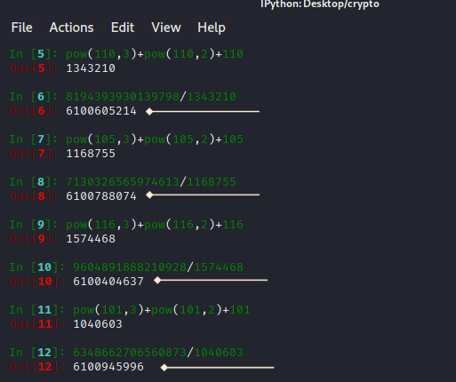
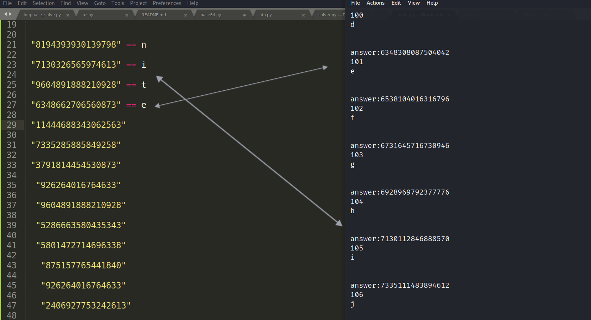

<center></center>

## Challenge name : Variablezz

- We are presented with two files enc.py and ciphertext.txt

```
import random
flag = 'nite{XXXXXXXXXXXXXXXXXXXXXXXX}'
a = random.randint(1,9999999999)
b = random.randint(1,9999999999)
c = random.randint(1,9999999999)
d = random.randint(1,9999999999)
enc = []
for x in flag:
    res = (a*pow(ord(x),3)+b*pow(ord(x),2)+c*ord(x)+d)
    enc.append(res)
print(enc)

```

## Decoding the python script:

- The program generates a four very long integers which stores into the variables a,b,c,d.
- Then each character present in the flag is sent to a equation.
- In the equation the character value of each letter is converter into ascii form ==> n = 110
- The value is passed down to the expression (a*pow(ord(x),3)+b*pow(ord(x),2)+c*ord(x)+d) ==> (a*pow(110,3)+b*pow(110,2)+c*110+d)
- We can clearly see this is an cubic equation ax^3 + bx^2 + cx + d = 0 

## Encrypted values:

- we also have ciphertext file which contains encrypted values of each letter in the flag.

```
Ciphertext = [8194393930139798, 7130326565974613, 9604891888210928, 6348662706560873, 11444688343062563, 7335285885849258, 3791814454530873, 926264016764633, 9604891888210928, 5286663580435343, 5801472714696338, 875157765441840, 926264016764633, 2406927753242613, 5980222734708251, 5286663580435343, 2822500611304865, 5626320567751485, 3660106045179536, 2309834531980460, 12010406743573553]

Since we know the flag format nite{},we know the first four encrypted values belongs to nite

n = 8194393930139798  = 110
i = 7130326565974613   = 105
t = 9604891888210928   = 116
e = 6348662706560873  =  101
```

## Solving:

- We can assume the encrypted value for n =  *8194393930139798* should be derived from the expression (a*pow(110,3)+b*pow(110,2)+c*110+d) or ax^3+bx^2+cx+d where x =110
- For the second encrypted value i = *7130326565974613* should be derived from the expression  (a*pow(105,3)+b*pow(105,2)+c*105+d) or ax^3+bx^2+cx+d where x =105 and so on for the next characters.
- Initial thought process is  divide the encrypted value with known values x^3+x^2+x accordingly and notice the result.
- encrypted value of n / x^3+x^2+x  where x is 110 ,encrypted value of i / x^3+x^2+x  where x is 105 and so on for the next 2 characters t,e

     <center></center>
- when doing so we are getting the values 6100605214,6100788074,6100404637,6100945996 which all seems similar and have a slight changes.
- I took the resultant value of n and named it powerless = 6100605214
- My approach is to substitue standard ascii characters 0-127 in x^3+x^2+x and multiply with powerless,By doing so i can compare these values to encrypted values and map them to characters

     <center></center>
     
     ```
     I created the below script to generate the corresponding values and matched them manually.
     
     powerless = 6100605214

    for i in range (0,127):
	    finder = i + pow(i,2) + pow(i,3)
	    encval = powerless * finder
	    encval = str(encval)

	    print("answer:"+encval)
	    print(i)
    	print(chr(i))
	    print("\n")
    ```

