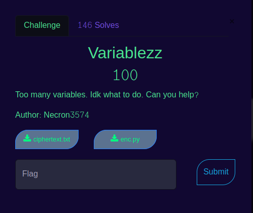

<center></center>

## Challenge name : Variablezz

- We are presented with two files enc.py and ciphertext.txt

```
import random
flag = 'nite{XXXXXXXXXXXXXXXXXXXXXXXX}'
a = random.randint(1,9999999999)
b = random.randint(1,9999999999)
c = random.randint(1,9999999999)
d = random.randint(1,9999999999)
enc = []
for x in flag:
    res = (a*pow(ord(x),3)+b*pow(ord(x),2)+c*ord(x)+d)
    enc.append(res)
print(enc)

```

## Decoding the python script

- The program generates a four very long integers which stores into the variables a,b,c,d.
- Then each character present in the flag is sent to a equation.
- In the equation the character value of each letter is converter into ascii form ==> n = 110
- The value is passed down to the expression (a*pow(ord(x),3)+b*pow(ord(x),2)+c*ord(x)+d) ==> (a*pow(110,3)+b*pow(110,2)+c*110+d)
- We can clearly see this is an cubic equation ax^3 + bx^2 + cx + d = 0 

## Encrypted values

- we also have ciphertext file which contains encrypted values of each letter in the flag.

```
Ciphertext = [8194393930139798, 7130326565974613, 9604891888210928, 6348662706560873, 11444688343062563, 7335285885849258, 3791814454530873, 926264016764633, 9604891888210928, 5286663580435343, 5801472714696338, 875157765441840, 926264016764633, 2406927753242613, 5980222734708251, 5286663580435343, 2822500611304865, 5626320567751485, 3660106045179536, 2309834531980460, 12010406743573553]
```
